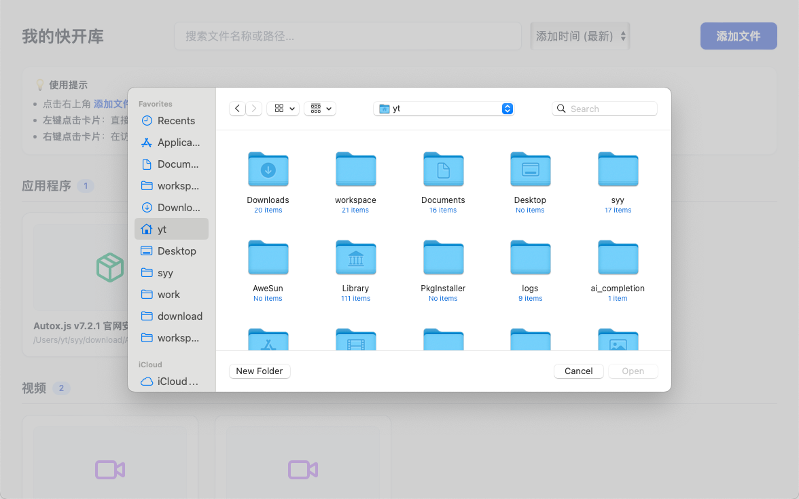
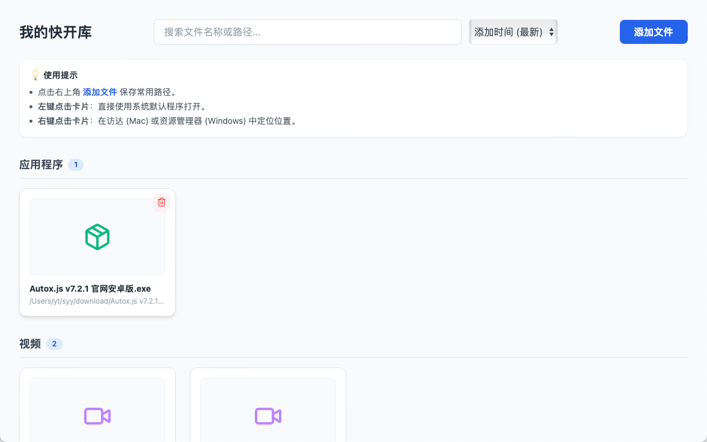
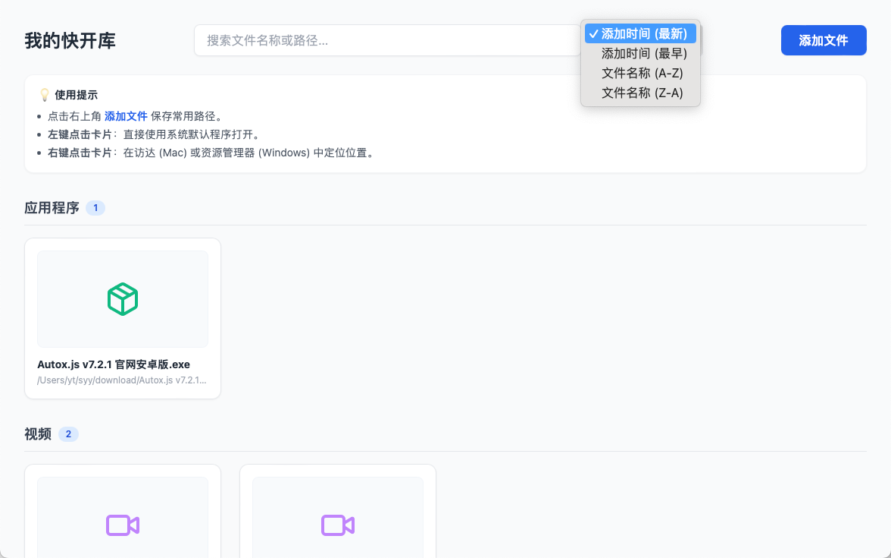
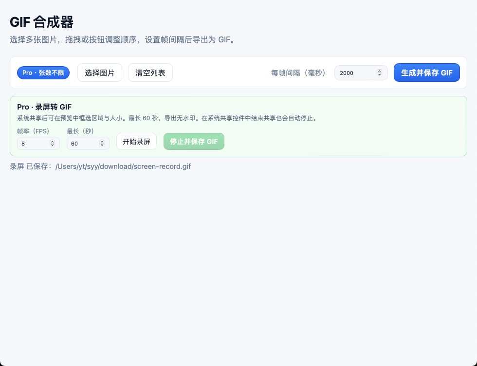
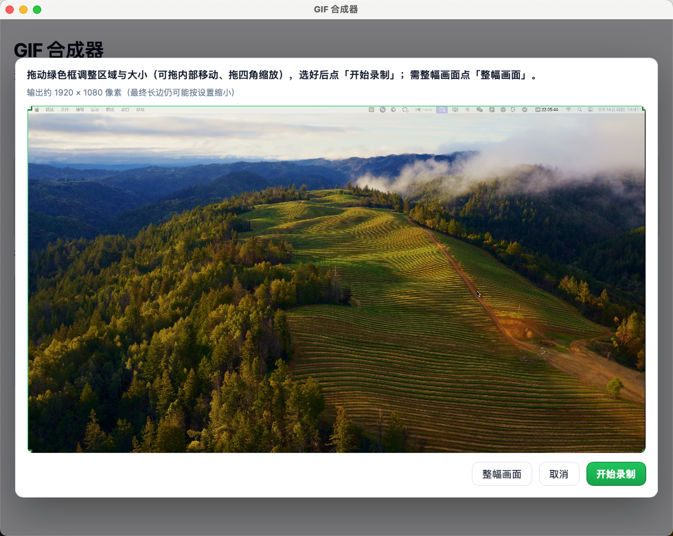

# OmniKit

> All your tools, one place

OmniKit 是一款基于 **Tauri 2** 的跨平台（macOS / Windows）桌面工具集，将 **快开（QuickOpen）** 与 **GIF 合成器** 整合在同一应用中。左侧导航可一键切换模块，数据与功能彼此独立。

---

## 模块概览

| 模块 | 说明 |
|------|------|
| **快开** | 记录高频文件/文件夹，卡片式展示，一键打开、右键定位 |
| **GIF 合成器** | 多图合成 GIF、录屏转 GIF、本地视频转 GIF |

---

## 快开

将工作与生活中**高频使用、但容易忘记路径**的文件或文件夹统一收录，以卡片瀑布流展示，支持**一键打开**与**右键在访达/资源管理器中定位**。

### 核心特性

- **原生体验**：Tauri v2 构建，体积小、内存占用低
- **智能图标**：内置常见格式图标，无需截图也能辨识类型
- **极简交互**：
  - **左键**：用系统默认程序打开
  - **右键**：在文件管理器中定位并高亮
  - **悬浮删除**：仅从库中移除记录，**不删除源文件**
- **搜索与排序**：按名称或路径模糊搜索，支持按时间/名称排序
- **分类过滤**：左侧按文件类型分组，点击即可筛选
- **拖拽添加**：将文件或文件夹拖入窗口即可入库
- **纯本地**：记录存于本机 SQLite，不联网








### 支持的文件类型

图片、视频、音频、压缩包、磁盘镜像、应用程序、脚本、电子表格、幻灯片、文档、产品与设计、数据库、配置文件、代码文件、字体等；未匹配格式归入**其他文件**。

---

## GIF 合成器

基于 **Vite + TypeScript**，在 macOS 与 Windows 上可将多张图片合成 GIF，也可录屏或上传短视频转 GIF 并保存到本地。

### 功能

- 选择多张本地图片（PNG / JPEG / GIF / WebP / BMP）
- 列表支持**拖拽排序**，或用「上移 / 下移」微调
- 设置**每帧间隔（毫秒）**，循环播放
- 画布以**第一张图**为基准，其余图等比缩放并居中铺白底
- 系统对话框选择路径导出 `.gif`
- **录屏转 GIF**：通过 FFmpeg 抓屏（avfoundation / gdigrab / x11grab）；最长 60 秒、无水印；选区基于一张静态屏幕快照框选
- **视频转 GIF**：通过 FFmpeg 解码任意常见视频格式（MP4 / M4V / MOV / AVI / MKV / WebM / FLV / WMV / TS 等），时长最长 60 秒






### 使用说明

- GIF 每帧经颜色量化，体积与观感会有折中
- **FFmpeg**：录屏与视频转 GIF 由 Rust 端通过 [ffmpeg-sidecar](https://crates.io/crates/ffmpeg-sidecar) 启动 FFmpeg 子进程完成。
- **首次下载 ffmpeg**：未带二进制启动时，`ffmpeg-sidecar` 会自动从 GitHub Release 下载约 80MB 的静态构建。也可手动 `npm run ffmpeg:download` 提前下载。
- **把 ffmpeg 打进安装包**（避免下载）：
  1. `npm run ffmpeg:download:all`（或单独 `npm run ffmpeg:download -- --target=macos-arm64` 等）把三平台 ffmpeg 静态构建下载到 `resources/ffmpeg/`。
  2. `npm run tauri:build` 时 Tauri 会自动把 `resources/ffmpeg/*` 拷到应用内（macOS: `*.app/Contents/Resources/_up_/ffmpeg/`，Windows: `resources/ffmpeg/`）。
  3. 应用启动时 `src-tauri/src/lib.rs` 的 `locate_bundled_ffmpeg` 会优先找到内嵌二进制，写入 `FFMPEG_PATH` 环境变量，`ffmpeg_export::ensure_ffmpeg` 优先使用之；找不到时回退到 `ffmpeg-sidecar` 自动下载。
- **录屏平台差异**：
  - macOS：在 OmniKit 进程内截屏（xcap），会弹出系统「屏幕录制」授权；请在「系统设置 → 隐私与安全性 → 屏幕录制」中允许本应用。
  - Windows：使用 `gdigrab` 抓 desktop，无需额外配置。
  - Linux：使用 `x11grab`，需安装 `xdg-desktop-portal` 与 xcb 库。
- **视频转 GIF**使用 FFmpeg 解码，**支持几乎所有常见格式**（不再受 WebView 解码能力限制）：MP4、M4V、MOV、AVI、MKV、WebM、FLV、WMV、MPEG、TS、M2TS、3GP、OGV 等。

---

## 技术栈

- **底层**：[Tauri v2](https://v2.tauri.app/)（Rust）
- **前端**：[React 19](https://react.dev/) + [Vite](https://vitejs.dev/) + [TypeScript](https://www.typescriptlang.org/)
- **UI**：[Tailwind CSS v3](https://tailwindcss.com/) + [Lucide React](https://lucide.dev/)
- **快开存储**：[SQLite](https://sqlite.org/)（`rusqlite`）
- **GIF 编码**：Rust `gif` / `image` + 前端 `gifenc`

---

## 环境要求

1. [Node.js](https://nodejs.org/) >= 18
2. [Rust](https://www.rust-lang.org/tools/install) >= 1.70（通过 rustup 安装）
3. 系统构建环境：
   - **macOS**：Xcode Command Line Tools（`xcode-select --install`）
   - **Windows**：Visual Studio Build Tools（含 MSVC）+ WebView2

### 安装 Rust（简要）

**macOS / Linux：**

```bash
curl --proto '=https' --tlsv1.2 -sSf https://sh.rustup.rs | sh
source "$HOME/.cargo/env"
cargo --version
```

**Windows：** 从 [rustup.rs](https://rustup.rs/) 安装，或使用 `winget install Rustlang.Rustup`。

---

## 开发与打包

```bash
git clone https://github.com/mango-Yu/omnikit.git
cd omnikit
npm install
npm run tauri:dev    # 开发（热更新）
npm run tauri:build  # 本地打包
```

安装包输出目录：`src-tauri/target/release/bundle/`（macOS：`.app` / `.dmg`；Windows：`.exe` 等，依配置而定）。

首次 `tauri dev` 会编译 Rust 依赖，可能需要数分钟；之后启动会快很多。

---

## 发布（Git Tag → GitHub Actions）

推送符合 `v*` 的版本 tag 后，会自动触发 [`.github/workflows/release.yml`](.github/workflows/release.yml)，每次只产出两个安装包：

| 平台 | 产物 |
|------|------|
| macOS | 一个通用 `.dmg`（`universal`，Intel / Apple Silicon 均可） |
| Windows | 一个 NSIS 安装包 `.exe` |

产物会上传到对应 tag 的 **GitHub Release**。打开 **Releases**（不是 Tags）即可下载 `.dmg` / `.exe`。

> Tags 页里的 `Source code (zip/tar.gz)` 只是源码压缩包，**不是**安装包。安装包只出现在 Releases 的 Assets 里。

### 发布前检查

1. 三个文件的版本号保持一致：
   - `package.json`
   - `src-tauri/tauri.conf.json`
   - `src-tauri/Cargo.toml`
2. 功能在本地验证通过：`npm run tauri:build`
3. 相关改动已合并到 `main` 并推送到远程

### 一键发版（推荐）

先确保功能改动已提交，工作区干净，然后：

```bash
npm run release -- 0.1.1
```

脚本会自动：同步三处版本号 → 提交 → 推送 → 打 `v0.1.1` tag → 触发 CI 打包。

常用选项：

```bash
npm run release -- 0.1.1 --dry-run      # 只预览，不执行
npm run release -- 0.1.1 --yes          # 跳过确认
npm run release -- 0.1.1 --no-push      # 只本地提交+打 tag
npm run release -- 0.2.0-beta.1         # 预发布
```

### 手动打 tag

若不用脚本，版本号示例以 `0.1.0` 为例（tag 必须带 `v` 前缀）：

```bash
git checkout main && git pull
git tag -a v0.1.0 -m "release: v0.1.0"
git push origin v0.1.0
```

预发布可用带连字符的 tag，例如 `v0.2.0-beta.1`（CI 会标记为 prerelease）。

### 发布后

1. 打开仓库 **Actions**，确认 `Release` 工作流全部变绿
2. 打开 **Releases**（侧边或仓库首页右侧），检查 Assets 是否包含：
   - `OmniKit_*_universal.dmg`
   - `OmniKit_*-setup.exe`
3. 不要到 **Tags** 页找安装包（那里只有源码压缩包）

若某次没挂上安装包，可在 Actions 里手动运行 `Release`，填写已存在的 tag（如 `v0.1.0`）重新打包上传。

### 仓库权限

若 CI 报 `Resource not accessible by integration`，到仓库 **Settings → Actions → General → Workflow permissions**，勾选 **Read and write permissions**。

### 提交规范（可选）

若不希望提交信息中出现 Cursor 自动署名，可启用仓库钩子（仅需一次）：

```bash
git config core.hooksPath .githooks
```

---

## macOS：提示「已损坏，无法打开」

从网上下载的未签名应用可能触发 Gatekeeper。在信任来源的前提下，对 `.app` 执行：

```bash
xattr -cr "/Applications/OmniKit.app"
```

也可在 Finder 中**右键 → 打开 → 打开**。路径请按实际安装位置调整。

---

## 路线图

**快开**

- [x] 拖拽添加
- [x] 分类标签系统
- [ ] 全局快捷键（如读取剪贴板路径）
- [ ] 剪贴板截图作为卡片封面
- [ ] 多端同步

**GIF 合成器**

- [x] 多图合成、录屏转 GIF、视频转 GIF
- [x] 视频转 GIF 改用 FFmpeg（支持 MP4 / MOV / AVI / MKV / WebM 等所有常见格式）
- [x] 录屏改用 FFmpeg（脱离浏览器 getDisplayMedia）
- [x] 视频转 GIF / 录屏 实时进度事件（`video-to-gif-progress` / `record-progress`）
- [x] 录屏实时预览：3 FPS 持续刷新，框选时画面不再冻结
- [x] FFmpeg 静态构建打包进安装包（`npm run ffmpeg:download:all`）

---

## 许可证

见仓库根目录（如有）。图标替换可使用：

```bash
npx tauri icon ./your-icon.png
```
